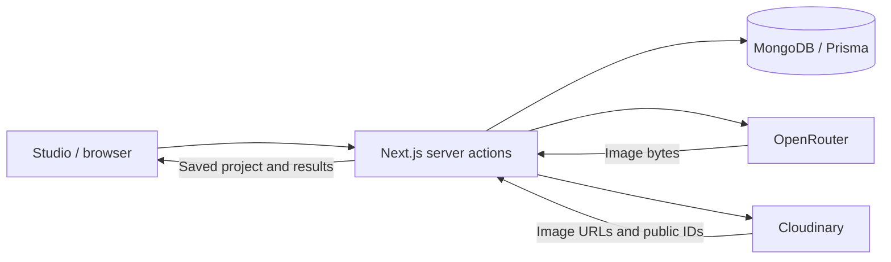

# SnapAI Studio

SnapAI Studio is a **Next.js 16 / React 19 application for AI product photography and campaign image generation**, written in TypeScript. It uses server actions for generation and account workflows, MongoDB with Prisma for transactional credit accounting, OpenRouter for text and image models, and Cloudinary for image storage. A Fabric.js editor supports saved canvas designs and PNG exports.

**Runtime:** Node.js 24 · **Database:** MongoDB replica set · **Package manager:** npm

[Run locally](#run-locally) · [Architecture](#architecture) · [Features](#features) · [Development and checks](#development-and-checks) · [Deployment](#deployment) · [Troubleshooting](#troubleshooting)

## Tech stack

| Area           | Technology                                         |
| -------------- | -------------------------------------------------- |
| Application    | Next.js 16 App Router, React 19, TypeScript        |
| UI             | Tailwind CSS 4, Radix UI, Geist, Phosphor icons    |
| Authentication | Auth.js with credentials and optional Google OAuth |
| Database       | MongoDB replica set with Prisma 6                  |
| AI             | OpenRouter image API and OpenAI-compatible SDK     |
| Image storage  | Cloudinary                                         |
| Email          | Resend                                             |
| Canvas editing | Fabric.js                                          |
| Verification   | Vitest, ESLint, TypeScript, GitHub Actions         |

Prisma 6 is retained for MongoDB support. The lockfile records the exact package versions used by the project.

## Run locally

### Prerequisites

- **Node.js 24** and npm; `.nvmrc` pins the recommended Node major version.
- **MongoDB replica set**, such as MongoDB Atlas, for transaction support.
- **OpenRouter and Cloudinary credentials** for live image generation and storage.
- **Resend API key and verified sender** for account verification and password recovery.

For a UI preview without configuring these services, use [isolated preview](#isolated-preview).

### 1. Install dependencies

From the repository root:

```sh
nvm install
nvm use
npm ci
cp .env.example .env
```

### 2. Configure the environment

Fill in `.env` using the [configuration table](#environment-variables). Keep `BASE_URL`, `NEXT_PUBLIC_APP_URL`, and `AUTH_URL` set to `http://localhost:3000` locally.

Generate an authentication secret and copy the output into `AUTH_SECRET`:

```sh
openssl rand -hex 32
```

### 3. Provision the database and start the server

```sh
npm run db:push
npm run dev
```

Open [localhost:3000](http://localhost:3000), register an account, and follow the verification link sent by email. Live generation requires both OpenRouter and Cloudinary to be configured.

> **Database setup:** MongoDB transactions need a replica set. A standalone local MongoDB process is insufficient for credit reservations and result persistence.

`db:push` provisions schema indexes separately from the production build. Inspect proposed changes before applying them to an existing database; never use a destructive reset for an upgrade.

### Environment variables

The complete template is in [`.env.example`](.env.example). Keep provider keys and database credentials in your local environment or hosting secrets.

| Variable                                                               | Purpose                                                                                |
| ---------------------------------------------------------------------- | -------------------------------------------------------------------------------------- |
| `DATABASE_URL`                                                         | MongoDB replica set connection                                                         |
| `AUTH_SECRET`                                                          | Auth.js session secret; generate with `openssl rand -hex 32`                           |
| `BASE_URL`, `NEXT_PUBLIC_APP_URL`, `AUTH_URL`                          | Application origin; use the same final HTTPS origin in production                      |
| `OPENROUTER_API_KEY`                                                   | Shared server-side AI generation key                                                   |
| `OPENROUTER_TEXT_MODEL`, `OPENROUTER_IMAGE_MODEL`                      | Optional overrides for the configured model defaults                                   |
| `CLOUDINARY_CLOUD_NAME`, `CLOUDINARY_API_KEY`, `CLOUDINARY_API_SECRET` | Image uploads and storage                                                              |
| `RESEND_API_KEY`, `FROM_EMAIL`                                         | Verification, password reset, and two factor emails; requires a verified sender domain |
| `NEXT_PUBLIC_SUPPORT_EMAIL`                                            | Operator contact address displayed in Settings                                         |
| `GOOGLE_CLIENT_ID`, `GOOGLE_CLIENT_SECRET`                             | Optional Google sign in                                                                |
| `CRON_SECRET`                                                          | Optional authenticated maintenance endpoint                                            |
| `NEXT_SERVER_ACTIONS_ENCRYPTION_KEY`                                   | Stable shared encryption key for multiple self-hosted instances                        |
| `GOOGLE_SITE_VERIFICATION`, `BING_SITE_VERIFICATION`                   | Optional webmaster-tool verification tokens                                            |

The configured defaults are `google/gemini-2.5-flash-lite` for text and vision, and `google/gemini-3.1-flash-lite-image` for images. The image model must support reference images and the [OpenRouter image API](https://openrouter.ai/docs/guides/overview/multimodal/image-generation). Set a spending cap on your shared provider key and check current model pricing before opening public registration.

For Google OAuth, register `/api/auth/callback/google` on your application origin as the authorized redirect URI. The Google button is hidden when its credentials are absent.

### Isolated preview

Explore the UI using a disposable local database:

```sh
# Stop any other server on port 3000 first.
npm run preview:isolated
```

Sign in with `preview@example.test` and `PreviewPass123!`.

| Preview behavior  | Details                                                                |
| ----------------- | ---------------------------------------------------------------------- |
| Database          | Temporary MongoDB replica set; does not use `DATABASE_URL` from `.env` |
| Seed data         | Verified account with 10 credits and one saved project                 |
| Images            | Public Cloudinary demo image for browsing and editing                  |
| External services | Email, OAuth, uploads, and AI generation disabled                      |
| Lifetime          | Stopping the process discards the temporary database                   |

The first run may download a MongoDB binary. Use this mode for development previews only.

## Architecture

The App Router serves the landing page, authentication screens, and workspace. Client components handle studio interactions and the Fabric.js canvas; server actions handle validation, account checks, generation, and persistence.



### Generation lifecycle

1. **Authenticate and validate:** resolve the user from the session, enforce request limits, and validate inputs and uploaded image signatures.
2. **Reserve credits:** atomically deduct the request cost and create a reservation expiring after 15 minutes.
3. **Generate and upload:** send product references to OpenRouter and upload original and generated images to Cloudinary. Product shots and campaign images run in parallel; variations run sequentially.
4. **Commit results:** save image records, settle the reservation, update the generated-image count, and mark the project completed in a database transaction.
5. **Handle failure:** refund unsettled reservations. Interrupted projects are marked failed during recovery after 15 minutes; recovery runs through user requests or scheduled maintenance.

Project statuses are `PENDING`, `IN_PROGRESS`, `COMPLETED`, and `FAILED`. A saved generation record tracks progress; generation itself runs within the server request.

### AI integration

| Operation                                | Implementation                                                                       |
| ---------------------------------------- | ------------------------------------------------------------------------------------ |
| Prompt assistance and creative direction | OpenAI-compatible SDK configured with OpenRouter's base URL                          |
| Reference image generation               | Server-side `POST https://openrouter.ai/api/v1/images`                               |
| Image request payload                    | Model, prompt, aspect ratio, and `input_references`; one output per provider request |
| Image response                           | Base64 bytes decoded into a buffer and uploaded to Cloudinary                        |
| Provider deadline                        | 90 seconds per request; automatic SDK retries disabled                               |
| Product shot composition                 | Square `1:1`, landscape `3:2`, or portrait `2:3`                                     |

Model defaults and overrides live in [`lib/openrouter.ts`](lib/openrouter.ts). Campaign generation creates five formats and applies Cloudinary transformations to produce the final output dimensions:

| Format          | Export dimensions |
| --------------- | ----------------- |
| Instagram post  | 1080 × 1080       |
| Instagram story | 1080 × 1920       |
| Facebook post   | 1200 × 630        |
| LinkedIn post   | 1200 × 627        |
| Website banner  | 1200 × 400        |

### Data model

MongoDB stores account records, project metadata, image URLs, and editor documents. Image files live in Cloudinary, with public IDs retained for storage cleanup.

| Prisma model                  | Responsibility                                                                    |
| ----------------------------- | --------------------------------------------------------------------------------- |
| `User`, `Account`             | Identity, OAuth accounts, roles, credit balance, and session version              |
| `Generation`                  | Project parameters, type, status, and original image reference                    |
| `ProductImage`                | Product shots and variations linked to a generation and user                      |
| `Submission`                  | Campaign details and five generated image references                              |
| `Design`                      | Serialized Fabric.js document, unique per user and image URL                      |
| `CreditReservation`           | Reserved amount, expiry, and settlement state                                     |
| `RateLimit`                   | Shared database counters for request windows across instances                     |
| Verification and reset tokens | Expiring email verification, password reset, and two factor codes                 |
| `Waitlist`                    | Legacy email collection model; the current endpoint directs users to registration |

See [`prisma/schema.prisma`](prisma/schema.prisma) for fields, relations, and indexes. Database transactions protect credit reservations, refunds, and result persistence; reservation and refund operations retry MongoDB write conflicts up to three attempts.

### Authentication and validation

- **Sessions:** Auth.js uses JWT sessions with the Prisma adapter. Session callbacks compare the user's stored `sessionVersion`; password changes increment it to invalidate older sessions.
- **Credentials:** passwords are hashed with bcrypt. Email verification is required for credentials sign in, with optional email two factor codes.
- **Ownership:** server actions derive identity from the session and check project or image ownership before reading or modifying account data.
- **Uploads:** JPG, PNG, and WebP, up to 3 MB per file, with MIME and byte-signature checks. Server action request bodies are capped at 4 MB in [`next.config.mjs`](next.config.mjs), including combined uploads.
- **Generation limits:** product shots, campaigns, and variations share a limit of three requests per user per minute. Product-shot prompts accept 10–2,000 characters; shot and variation counts are limited to 1–4.
- **Editor documents:** saved designs allow up to 100 objects, 500,000 characters, and canvas dimensions of 64–8,192 pixels per side. Image sources must match the owned image.

### Routes and entry points

Most application mutations use server actions in [`actions/`](actions/); the HTTP routes below support authentication, downloads, and maintenance.

| Route                                             | Purpose                                                                       | Access                                 |
| ------------------------------------------------- | ----------------------------------------------------------------------------- | -------------------------------------- |
| `/`                                               | Landing page                                                                  | Public                                 |
| `/auth/*`                                         | Sign in, registration, verification, and password recovery                    | Public entry points                    |
| `/dashboard`, `/submissions`, `/submissions/[id]` | Project library and results                                                   | Signed-in account                      |
| `/generate`                                       | Product photography and campaign studio                                       | Signed-in account                      |
| `/editor/[editId]`                                | Canvas editor                                                                 | Signed-in account with image ownership |
| `/settings`                                       | Profile and account settings                                                  | Signed-in account                      |
| `/api/auth/[...nextauth]`                         | Auth.js handlers                                                              | Provider/session-specific              |
| `GET /api/download?url=...`                       | Stream an owned Cloudinary image as an attachment                             | Signed-in image owner                  |
| `GET /api/maintenance`                            | Recover expired reservations and clean stale records                          | Bearer token matching `CRON_SECRET`    |
| `/api/waitlist`                                   | GET reports registration is open; POST returns 410 and points to registration | Public                                 |

## Features


- **Product photography:** upload a product photo, choose a setting and aspect ratio, and generate up to four shots.
- **Campaign creatives:** create five images formatted for Instagram posts, Instagram stories, Facebook, LinkedIn, and website banners.
- **Creative direction:** refine prompts with AI and create variations of saved images.
- **Project library:** reopen saved projects, view results, and download images.
- **Canvas editor:** add text and shapes, adjust colors, save your design, and export a PNG.
- **Account management:** email verification, password reset, optional Google sign in, email two factor authentication, profile settings, and account deletion.
- **Credit controls:** shared balance tracking, request limits, failed-request refunds, and recovery for interrupted generation.
- **Responsive interface:** a minimal landing page with a fine line grid and subtle gradients, plus a dashboard, mobile navigation, studio, and settings.
- **Search and sharing:** generated OG artwork, Open Graph and Twitter cards, canonical URLs, structured data, sitemap, robots rules, and branded icons.

## How it works

1. Create an account and verify your email.
2. Upload a clear product photo in JPG, PNG, or WebP format, up to 3 MB.
3. Describe the scene and generate product shots or a campaign.
4. Reopen your saved project, create variations, or finish it in the canvas editor.
5. Download your images or export your edited design.

New accounts receive **10 image credits**.

| Action                    | Credits     |
| ------------------------- | ----------- |
| Product shot              | 1 per image |
| Image variation           | 1 per image |
| Campaign with five images | 5           |

The allowance does not renew automatically. Paid plans, checkout, and credit purchases are not implemented. Failed generation requests refund their reserved credits.

## Development and checks

| Command                    | Purpose                                              |
| -------------------------- | ---------------------------------------------------- |
| `npm run dev`              | Start the development server                         |
| `npm run lint`             | Run ESLint                                           |
| `npm run typecheck`        | Generate route types and check TypeScript            |
| `npm test`                 | Run unit and database integration tests              |
| `npm run build`            | Generate Prisma Client and create a production build |
| `npm run check`            | Run lint, type checking, tests, and production build |
| `npm start`                | Serve the production build                           |
| `npm run db:push`          | Provision MongoDB schema indexes                     |
| `npm run preview:isolated` | Start the disposable preview environment             |

The current suite contains **27 tests**, including real MongoDB replica-set integration checks for competing credit transactions, refunds, ownership, saved designs, account security, and deletion. Provider responses are mocked in automated tests. GitHub Actions runs the project checks and `npm audit --omit=dev` on pushes and pull requests.

See the [verification report](docs/VERIFICATION.md) for tested behavior and external-service checks still required before launch. Production dependencies passed the recorded audit; development-only upstream advisories are documented there.

## Deployment

1. Provision MongoDB, OpenRouter, Cloudinary, and a Resend verified sender.
2. Configure hosting secrets and the final HTTPS application origin.
3. Run `npm run db:push` against the intended database after reviewing changes.
4. Build with `npm run build` and serve with `npm start`, or use Vercel's Next.js preset.
5. Run the live-service smoke checks and SEO launch checklist before accepting public traffic.

Generation uses bounded server requests with a 300-second page limit and parallel image requests with 90-second provider deadlines. Your hosting tier and reverse proxy must support the required request duration. A separate durable job queue is not included.

Optional maintenance uses `GET /api/maintenance` with `Authorization: Bearer YOUR_CRON_SECRET`. Schedule it every 15 minutes to recover expired credit reservations and clean up stale records. User requests also recover that user's expired reservations.

Account pages are private, while Cloudinary image URLs are shareable. Landing photography is labeled as art direction references. Provider-generated output should be reviewed for product details and suitability before publishing.

Full setup and operating details: [deployment guide](docs/DEPLOYMENT.md) and [Cloudinary configuration](CLOUDINARY_SETUP.md).

## Troubleshooting

| Symptom                                      | Check                                                                                                           |
| -------------------------------------------- | --------------------------------------------------------------------------------------------------------------- |
| MongoDB transaction or replica-set error     | Use an Atlas cluster or local replica set; check `DATABASE_URL`, database credentials, and network access       |
| Missing Prisma Client or schema indexes      | Run `npm run db:push` after configuring `.env`; the production build also generates Prisma Client               |
| Verification or reset email missing          | Check `RESEND_API_KEY`, the verified `FROM_EMAIL` sender, and the application origin used in email links        |
| Google sign in hidden or callback rejected   | Set both Google credentials and register `http://localhost:3000/api/auth/callback/google` for local development |
| Generation unavailable or upload failed      | Check OpenRouter and Cloudinary credentials, provider access, and the selected model's reference-image support  |
| Request body too large                       | Keep the complete multipart request below the 4 MB action limit, even when each image is below 3 MB             |
| Generation interrupted with credits reserved | Allow the 15-minute reservation to expire, then make an authenticated request or run maintenance                |
| Isolated preview fails to start              | Free port 3000 and allow the MongoDB binary download on first use                                               |

## SEO and branding

The generated [OG image](app/opengraph-image.jpg) is served at `/opengraph-image.jpg` and used for Open Graph and Twitter large-image cards. Public pages have individual titles, descriptions, canonical URLs, and sharing metadata. The landing page includes WebSite and WebApplication JSON-LD. Authentication and workspace routes are excluded from indexing and the public sitemap.

Set the final application origin before building, connect Search Console and Bing Webmaster Tools, and submit `/sitemap.xml` after deployment.

- [SEO verification report](docs/seo/FULL-AUDIT-REPORT.md)
- [SEO launch checklist](docs/seo/ACTION-PLAN.md)

## Project structure

```text
app/                 Landing, authentication, workspace pages, API routes, metadata
components/          Studio, editor, navigation, forms, and shared UI
actions/             Server actions for accounts, generation, and saved designs
lib/                 Database, OpenRouter, validation, credits, security, and SEO
utils/               Generation pipelines and account/project query helpers
schemas/             Account and form validation schemas
context/             Canvas state provider
prisma/              MongoDB schema
tests/               Unit and replica-set integration tests
scripts/             Isolated preview tooling
docs/                Deployment, verification, and SEO documentation
```

## License

[MIT](LICENSE) © Hassan.
